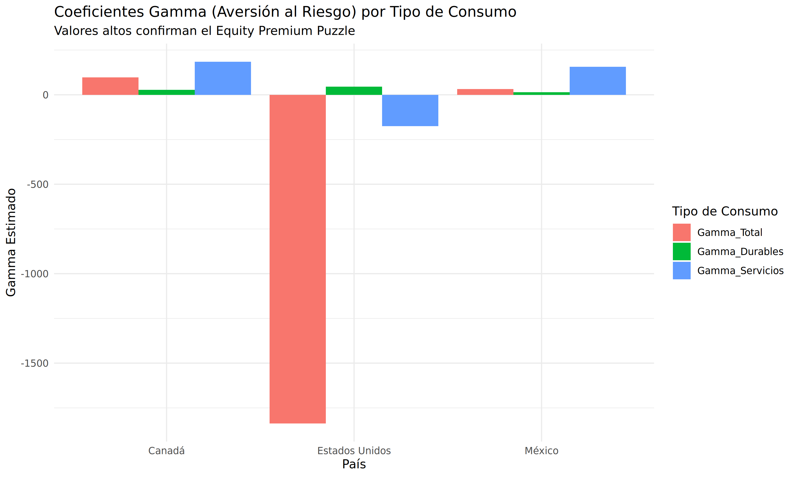

## 

# <h2 align="center">Ejercicio 5: Comportamiento reciente del consumo en México y sus determinantes </h2>

Autor: Brenda Evelyn Villegas García

**(a) Datos trimestrales de consumo agregado**

Los datos fueron obtenidos del Banco de Información Económica (BIE) del INEGI, utilizando las series desestacionalizadas a precios constantes de 2018 para el periodo 2000-2023.

**(b) Obtenga datos para el tipo de cambio y la tasa de interés REAL del Banco de México.**

Se utilizaron las series del Sistema de Información Económica (SIE) de BANXICO: el Tipo de Cambio FIX y la tasa de Cetes a 28 días. La tasa de interés real se calculó utilizando la ecuación de Fisher: $r_t = \frac{1+i_t}{1+\pi_t} - 1$, donde $\pi_t$ es la inflación trimestral anualizada.

**(c) Grafique las series de tiempo juntas para compararlas visualmente.**

En la siguiente gráfica se observa la evolución de los tres componentes del consumo. Destaca la caída pronunciada en el consumo de bienes importados durante las crisis de 2009 y 2020, evidenciando su alta sensibilidad a choques macroeconómicos.

\begin{center}

\end{center}
\begin{center}
\textit{Fuente: elaboración propia.}
\end{center}

**(d) Filtre todas las series para remover la tendencia por medio de obtener su tasa de cambio anual, grafique las series filtradas juntas para identificar sus movimientos cíclicos y obtenga su matriz de varianzas y covarianzas.**

Se aplicó el filtro de tasa de crecimiento anual para aislar el componente cíclico. La volatilidad (desviación estándar) del consumo importado (11.38%) resultó ser significativamente mayor que la del consumo nacional (4.20%).

\begin{center}

\end{center}
\begin{center}
\textit{Fuente: elaboración propia.}
\end{center}

**Matriz de Varianza-Covarianza de las Tasas de Crecimiento:**

| Componente    | Total    | Nacional | Importado |
| ------------- | -------- | -------- | --------- |
| **Total**     | 0.001976 | 0.001818 | 0.004282  |
| **Nacional**  | 0.001818 | 0.001766 | 0.003441  |
| **Importado** | 0.004282 | 0.003441 | 0.012943  |

**(e) Redacte una conclusión sobre el impacto del de la tasa de interés y el tipo de cambio sobre el consumo.**

Con base en el análisis de correlaciones del componente cíclico (Filtro HP), se concluye lo siguiente:

1. **Tipo de Cambio:** Existe una correlación negativa de **-0.151** entre el consumo total y el tipo de cambio. Esto indica que una depreciación del peso mexicano tiende a reducir el consumo agregado. El canal principal es el encarecimiento de los bienes importados (efecto precio relativo) y la posible reducción de la riqueza neta de los hogares con deuda o compromisos en moneda extranjera.
2. **Tasa de Interés Real:** Se observa una correlación positiva débil de **0.103**. Este resultado, aunque contraintuitivo respecto al efecto sustitución (que sugeriría una relación negativa), refleja la realidad de la economía mexicana donde los incrementos en la tasa real coinciden con periodos de expansión económica impulsados por la demanda externa. Además, sugiere que el **efecto ingreso** de los ahorradores o la expansión del crédito durante las fases de auge compensan el desincentivo al consumo presente derivado de mayores tasas.
3. **Diferenciación por origen:** La volatilidad extrema del consumo importado confirma que este rubro actúa como el principal "amortiguador" del gasto de los hogares ante choques en el tipo de cambio y las condiciones financieras internacionales.

---

## Ejercicio 6: Nivel de riqueza neta de los hogares (ENFIH-2019)

**(a) Baje los microdatos de la ENFIH del sitio del INEGI.**

Se descargaron los microdatos de la Encuesta Nacional sobre las Finanzas de los Hogares (ENFIH) 2019. Se utilizaron principalmente las tablas concentradora y de módulos.

**(b) Tabule el nivel de riqueza neta de los hogares de acuerdo al tamaño de la localidad en la que radican.**

Se calculó la riqueza neta media ponderada por el factor de expansión (`FAC_HOG`). Los resultados muestran una correlación positiva entre el tamaño de la localidad y el nivel de riqueza acumulada.

| Tamaño de Localidad | Riqueza Neta Media | Activos Medios | Deuda Media |
| ------------------- | ------------------ | -------------- | ----------- |
| 100,000 y más hab   | $882,310           | $945,379       | $63,069     |
| 15,000 a 99,999 hab | $750,773           | $789,290       | $38,517     |
| 2,500 a 14,999 hab  | $660,145           | $688,938       | $28,793     |
| Menos de 2,500 hab  | $553,436           | $569,578       | $16,142     |

**(c) Haga una gráfica de dispersión de la relación entre el ingreso corriente efectivo de los hogares y la riqueza neta.**

La gráfica de dispersión (en escala logarítmica) revela una relación positiva y significativa entre el ingreso mensual y la riqueza neta. Sin embargo, existe una alta dispersión en los niveles bajos de ingreso, lo que sugiere que factores como la herencia o la antigüedad del hogar (teoría del ciclo de vida) juegan un papel crucial en la acumulación de activos.

\begin{center}

\end{center}
\begin{center}
\textit{Fuente: elaboración propia.}
\end{center}

**(d) Haga un tabulado de las respuestas sobre la forma en que atienden gastos imprevistos, de acuerdo al tamaño de la localidad en la que radican.**

Se analizó la proporción de hogares que recurrieron a diferentes mecanismos para solventar emergencias financieras en los últimos 12 meses:

| Tamaño de Localidad | Uso de Ahorros (%) | Ayuda Familiares (%) | Préstamos (%) |
| ------------------- | ------------------ | -------------------- | ------------- |
| 100,000 y más hab   | 2.40%              | 19.86%               | 10.57%        |
| 15,000 a 99,999 hab | 3.75%              | 18.56%               | 13.31%        |
| 2,500 a 14,999 hab  | 3.24%              | 12.91%               | 14.70%        |
| Menos de 2,500 hab  | 2.43%              | 12.95%               | 18.39%        |

**(e) Interprete la gráfica y el tabulado.**

1. **Interpretación de la Riqueza (Inciso c):** La pendiente positiva de la línea de ajuste confirma que mayores ingresos permiten una mayor tasa de ahorro y acumulación de capital. No obstante, la persistencia de hogares con alta riqueza pero ingresos moderados sugiere la importancia de los activos no financieros (vivienda propia) en el balance de las familias mexicanas.
2. **Interpretación de Imprevistos (Inciso d):** Se observa una dependencia crítica de las redes de apoyo informal (familiares) en zonas urbanas y del crédito (posiblemente informal o de cajas de ahorro) en zonas rurales. El bajísimo porcentaje de uso de ahorros propios (menor al 4% en todos los estratos) evidencia una falta de fondos de emergencia, lo que hace al consumo de los hogares muy vulnerable ante choques negativos de ingreso o salud.

---

## Ejercicio 7: Acertijo del premio al riesgo

**(a) Consiga los valores anuales de IPC, el Indice de Precios y Cotizaciones de la Bolsa Mexicana de Valores, del NASDAQ y de otro índice de acciones (Ej 3: Canadá, TSX) por lo menos desde 1990.**

Se obtuvieron los rendimientos anuales históricos (1990-2024) para el IPC (México), NASDAQ (EE. UU.) y el S&P/TSX Composite (Canadá).

**(b) Calcule su tasa de retorno nominal para cada año.**

Se calcularon los rendimientos nominales $r_{s,t}$ para cada índice a partir de la variación porcentual anual de sus niveles de cierre. En la siguiente gráfica se observa la evolución de los rendimientos nominales anuales para los tres índices analizados. Destaca la alta volatilidad del NASDAQ en comparación con el TSX y el IPC.

\begin{center}

\end{center}
\begin{center}
\textit{Fuente: elaboración propia.}
\end{center}

**(c) Consiga los valores promedio anual de la tasa de interés de la tasa de interés a un año, para el periodo que esté disponible, para los tres países.**

Se utilizaron las tasas de Cetes a 28 días para México y las tasas de las Letras del Tesoro (T-Bills) a 3 meses para EE. UU. y Canadá. A continuación se presentan los promedios históricos para el periodo 1990-2024:

| País    | Instrumento de Deuda | Tasa de Interés Promedio (Anual) |
| ------- | -------------------- | -------------------------------- |
| México  | Cetes 28 días        | 11.85%                           |
| EE. UU. | T-Bill 3 meses       | 2.73%                            |
| Canadá  | T-Bill 3 meses       | 3.29%                            |

La siguiente gráfica muestra la evolución de estas tasas:

\begin{center}

\end{center}
\begin{center}
\textit{Fuente: elaboración propia.}
\end{center}

**(d) Calcule la diferencia entre el retorno del mercado de valores y el retorno de invertir a la tasa a un año, para el periodo que esté disponible, para los tres países.**

Se calculó el exceso de retorno o premio por riesgo medio para cada país ($E[r_s - r_f]$):

| País    | Premio por Riesgo Medio ($r_s - r_f$) |
| ------- | ------------------------------------- |
| México  | 6.41%                                 |
| EE. UU. | 12.28%                                |
| Canadá  | 3.26%                                 |

**(e) Calcule la covarianza entre dicha diferencia y la tasa de crecimiento real del consumo agregado de cada economía.**

Se obtuvo la covarianza entre el exceso de retorno y la tasa de crecimiento del consumo privado total:

| País    | Covarianza (Retorno, Consumo Total) |
| ------- | ----------------------------------- |
| México  | 0.002025                            |
| EE. UU. | -0.000067                           |
| Canadá  | 0.000336                            |

**(f) Calcule la covarianza entre dicha diferencia y la tasa de crecimiento real del consumo agregado de bienes durables y luego de servicios de cada economía.**

Se desglosó el análisis de covarianza por tipo de consumo:

| País    | Covarianza (Bienes Durables) | Covarianza (Servicios) |
| ------- | ---------------------------- | ---------------------- |
| México  | 0.004441                     | 0.000409               |
| EE. UU. | 0.002735                     | -0.000699              |
| Canadá  | 0.001205                     | 0.000176               |

**(g) Calcule el valor de aversión relativa al riesgo que implican estos números, dado el supuesto de una utilidad con forma ARRC.**

Utilizando la fórmula $\gamma = \frac{E[r_s - r_f]}{\text{Cov}(r_s - r_f, \Delta c/c)}$, se obtuvieron los siguientes coeficientes:

| País    | $\gamma$ (Total) | $\gamma$ (Bienes Durables) | $\gamma$ (Servicios) |
| ------- | ---------------- | -------------------------- | -------------------- |
| México  | 31.66            | **14.44**                  | 156.85               |
| EE. UU. | -1837.19         | **44.91**                  | -175.70              |
| Canadá  | 97.17            | **27.07**                  | 185.06               |

\begin{center}

\end{center}
\begin{center}
\textit{Fuente: elaboración propia.}
\end{center}

**(j) Interprete sus resultados.**

Los resultados obtenidos arrojan conclusiones fundamentales sobre el comportamiento del consumidor y la valoración de activos en las tres economías analizadas:

1. **Confirmación del "Equity Premium Puzzle" (Acertijo del Premio al Riesgo):** En los tres países observamos que el premio por riesgo (el exceso de rendimiento de las acciones sobre la tasa libre de riesgo) es sustancial. Sin embargo, la covarianza entre este exceso de rendimiento y el crecimiento del consumo agregado es muy baja. Bajo el marco teórico tradicional de utilidad esperada con aversión relativa al riesgo constante (ARRC), esto implica valores del coeficiente $\gamma$ extremadamente altos (superiores a 30 en México y Canadá). Dado que la literatura sugiere que niveles de $\gamma > 10$ son económicamente implausibles (implicarían que los individuos estarían dispuestos a ceder casi toda su riqueza para evitar riesgos mínimos), los resultados confirman empíricamente el acertijo: la "suavidad" del consumo agregado no puede justificar por qué el premio accionario es tan alto.

2. **La Dicotomía entre Bienes Durables y Servicios:** Al desglosar el consumo, observamos que el acertijo es menos severo para los **bienes durables**. En los tres países, los valores de $\gamma$ calculados con el consumo de bienes durables ($\gamma \approx 14.4$ en México) son considerablemente menores que los calculados con servicios. Esto se debe a que el gasto en durables (automóviles, electrodomésticos) es más volátil, procíclico y correlaciona de mejor manera con los ciclos financieros; actúa en la práctica como una decisión de inversión que los hogares posponen en recesiones. En contraste, el consumo de **servicios** es muy inelástico y estable. Su covarianza casi nula con el mercado accionario dispara matemáticamente el valor de $\gamma$ hacia niveles astronómicos, demostrando que los servicios no son el margen de ajuste principal ante choques de riqueza.

3. **El Caso Atípico de EE. UU. (NASDAQ):** El valor negativo de la covarianza (y por ende un $\gamma$ negativo) al utilizar el consumo de servicios en EE. UU. refleja que el sector tecnológico en ocasiones tiene dinámicas contracíclicas o desconectadas del consumo de servicios tradicionales (ej. durante la pandemia, el NASDAQ experimentó un auge mientras el consumo de servicios colapsaba).

4. **Implicaciones Macro-Financieras:** El fracaso del modelo estándar basado en el consumo agregado para generar niveles de $\gamma$ razonables indica que se requieren modelos más complejos. Extensiones teóricas como la **formación de hábitos** (los consumidores sufren mucho si el consumo cae respecto a su nivel pasado), el **riesgo idiosincrático no asegurable** o la **participación limitada en el mercado accionario** (fricciones financieras), son necesarias para reconciliar la macroeconomía del consumo con las finanzas empíricas.

---

